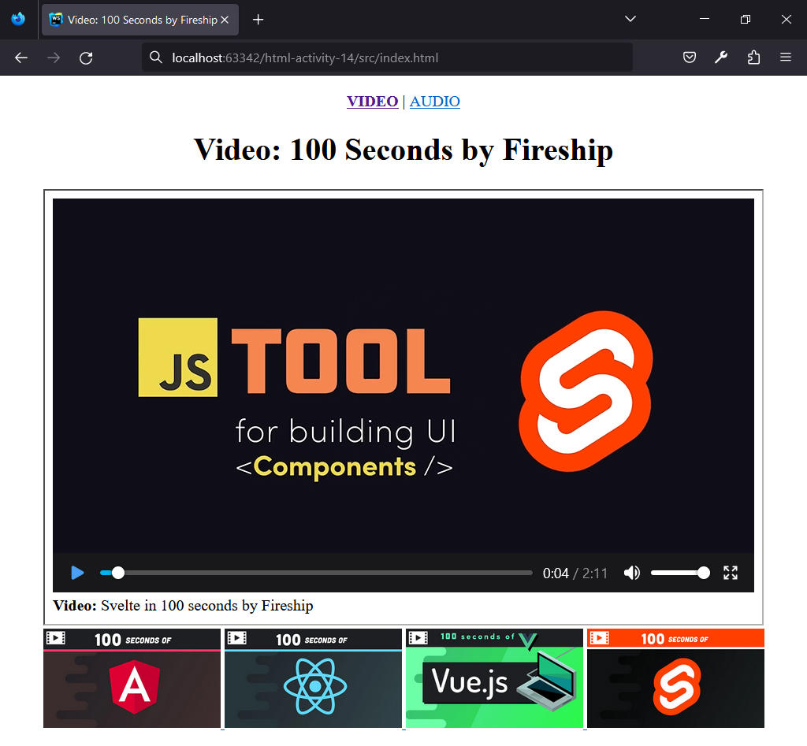

## HTML | Activity #14: Iframe, Audio and Video
Create a simple **Media Player** website with the following content:

#### Page 1: Video Player

#### Page 2: Audio Player

### Development Setup
Use the initial files provided in the [**src**](/src) folder
and complete the project by creating the remaining files.

To test your output, simply open any of your html files in your preferred web browser.
